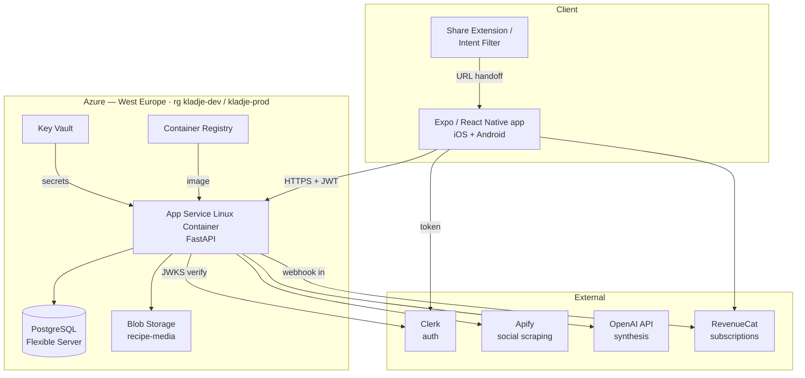

# 01 — Architecture

## Shape of the system

There is no batch layer, no queue, no data warehouse. One API, one database, one blob container,
three external services. That is the whole system, and keeping it that small is deliberate: you are
one person and every moving part is something that can page you at 22:00.

## Components

### Client — Expo / React Native

Single codebase, both platforms. Custom dev client via EAS Build from day one, because the share
extension is native code and Expo Go cannot host it. Details in `05-client.md`.

### API — FastAPI on App Service for Linux Containers

Stateless HTTP API. Holds one long-lived responsibility that shapes the deployment: the import
endpoint streams progress over SSE for 10–30 seconds. That means:

- **Always on, no scale-to-zero.** A cold start on the import progress screen is the difference
  between the product feeling magic and feeling broken.
- `WEBSITES_CONTAINER_START_TIME_LIMIT` raised, health check on `/healthz`.
- Uvicorn with a small number of workers; SSE connections are cheap but long, so worker count matters
  more than usual. Start with 2 workers × 4 threads on B1, measure, move to P0v3 when concurrent
  imports exceed a handful.

### Database — PostgreSQL Flexible Server

- West Europe, same region as everything else (AVG and latency)
- **B1ms burstable** to start, ~€15/month. Move to B2s when connection count or CPU credits bite
- Public network access with firewall rules + `require_secure_transport = ON`. Private endpoints are
  the "correct" answer and buy you nothing at this scale for a day of VNet work
- `pg_trgm` extension enabled for recipe/ingredient search. **No `pgvector`** — with D1 there is no
  catalogue to match against, so there is nothing to embed
- Connection pooling in-process via SQLAlchemy; Flexible Server's built-in PgBouncer is available if
  you outgrow it

### Blob Storage — media

New container `recipe-media` in the existing storage account for dev; a separate prod storage account
later. Contents:

- Recipe photo: Apify thumbnail, or a gallery/camera image the user picked (JPEG, ~1200px)
- User-uploaded cook-log photos
- Group avatars

Access pattern: API issues short-lived **user-delegation SAS URLs** on read. Never make the container
public — cook-log photos are personal data. Add Azure Front Door or CDN in front only when image
egress becomes visible on the bill.

Note: this is a *different* container from the `data` container holding the supermarket CSVs. Those
belong to Prakkie and this app never reads them.

### Key Vault

OpenAI key, Apify token, Clerk secret key, RevenueCat webhook secret, database password. App Service
reads them via managed identity and Key Vault references in app settings, so no secret ever sits in
a config file or a repo.

## External services

| Service | Role | Failure mode | Mitigation |
|---|---|---|---|
| Clerk | Google/Apple sign-in, JWT issuance | Nobody can log in | Cached JWKS, long-lived refresh tokens, existing sessions survive a short outage |
| Apify | TikTok/Instagram/YouTube **transcript** + metadata | Imports from those platforms fail | Per-platform circuit breaker; blogs and Pinterest use your own JSON-LD parser and keep working |
| OpenAI | Recipe synthesis only — no vision, cookbook OCR is deferred to v2 | All imports fail | Retry with backoff; clean error state offering manual entry |
| RevenueCat | Subscription state, receipt validation | Entitlements go stale | Cache entitlement in Postgres; grace period rather than instant lockout |

**Blogs and Pinterest do not go through Apify.** Parsing `schema.org/Recipe` JSON-LD yourself is a
hundred lines of Python, produces the highest-quality result of any source, and costs nothing. Build
that path first — it is the cheapest way to have a working product.

## Environments

Two, not three.

| | Dev | Prod |
|---|---|---|
| Resource group | `kladje-dev` (existing) | `kladje-prod` (new) |
| App Service | B1, `receptenapp-api-dev` | B1 → P0v3, `receptenapp-api` |
| Postgres | B1ms, shared server, `receptenapp_dev` db | B1ms, own server |
| Clerk | Development instance | Production instance |
| OpenAI | Same key, `env=dev` in metadata | Same key, `env=prod` |
| Apify | Same token | Same token |
| Mobile | EAS `development` + `preview` channels | EAS `production` channel |

A staging environment is a third thing to maintain and pay for. EAS preview builds against dev give
you the same confidence for a solo project.

## Deployment

- **API**: GitHub Actions → build image → push to ACR → App Service deployment slot swap. Alembic
  migrations run as a pre-deploy step against the target database, gated on the migration being
  backwards-compatible with the currently deployed code (expand/contract; never a destructive
  migration in the same release as the code that needs it).
- **Mobile**: EAS Build + EAS Submit. JS-only changes ship via EAS Update over-the-air, which is your
  single most valuable operational tool — it lets you fix a broken review screen without a two-day
  store review.
- **Infra**: Bicep in `infra/`, deployed with `az deployment group create`. Not Terraform; Bicep is
  first-party, and you already have `az` authenticated.

## Observability

Minimum viable, but not zero:

- **Application Insights** with the OpenTelemetry FastAPI instrumentation. Free tier covers you.
- One custom event per import with: source platform, duration per pipeline stage, cache hit/miss,
  token counts, estimated cost, outcome. **This is the most valuable telemetry in the product** —
  it tells you both where quality is failing and whether the paid tier is profitable.
- Alerts on: 5xx rate, import failure rate above 15%, p95 import duration above 45s, daily OpenAI
  spend above a threshold you set. That last one is a cost circuit breaker, not a nicety.
- Sentry in the client for JS errors and crashes.

## What this costs to run empty

| Item | Monthly |
|---|---|
| App Service B1 | ~€13 |
| PostgreSQL B1ms | ~€15 |
| Container Registry Basic | ~€5 |
| Blob + egress (low volume) | ~€2 |
| Key Vault | ~€0 |
| Application Insights | ~€0 (free tier) |
| Apify | €0 on free credits, ~€39 on Starter |
| Clerk | €0 up to 10k MAU |
| RevenueCat | €0 below $2.5k monthly tracked revenue |
| EAS Build | €0–€19 |
| Apple + Google developer | ~€10 amortised |
| **Total** | **~€45 without Apify Starter, ~€85 with** |

Break-even is roughly 40 paying subscribers. Keep that number in your head; it decides the roadmap.
