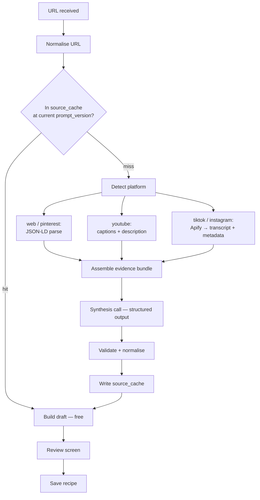

# 03 — Import Pipeline

This is the product. Everything else in the app is a place to put the output.

## Design principles

1. **Cheapest path first.** Blogs and Pinterest have structured recipe data sitting in the HTML. Read
   it. Don't send it to a scraper, barely touch a model. There is **no OCR or vision anywhere in v1** —
   see the update to ADR-014; cookbook-photo import is deferred to v2 on cost grounds.
2. **Never fabricate silently.** Anything the model invents gets `estimated` provenance and shows the
   user a yellow dot. A wrong oven temperature presented as fact is worse than a red "ontbreekt".
3. **Cache before you spend.** Check `source_cache` before any paid call.
4. **Always leave an exit.** Every failure state offers manual entry. A dead end costs you the user.
5. **Rewrite, never copy.** Method text is always reworded by the model. This is both a copyright
   requirement and a quality improvement. See `07-legal-avg.md`.

## Stage overview



## Stage 0 — URL normalisation

Runs before anything else because it's the cache key, and a bad cache key costs you real money.

Rules:

- Strip all tracking parameters (`utm_*`, `fbclid`, `igsh`, `_t`, `_r`, `si`, `feature`)
- Resolve shorteners by following redirects: `vm.tiktok.com`, `youtu.be`, `pin.it`, `l.instagram.com`
- Canonicalise host: lowercase, drop `www.`, drop `m.`
- Platform-specific canonical forms:
  - TikTok → `tiktok.com/@{author}/video/{id}`
  - Instagram → `instagram.com/reel/{shortcode}`
  - YouTube → `youtube.com/watch?v={id}` (Shorts collapse to this)
  - Pinterest → resolve to the **destination blog URL** where one exists; a Pin is usually a pointer
    to a real recipe page, and that page is a far better source than the Pin
- Strip trailing slashes and fragments

Store both `source_url` (what the user gave you, for the "bekijk origineel" link) and
`source_url_norm` (the cache key).

## Stage 1 — Platform routing

| Platform | Method | Cost | Expected quality |
|---|---|---|---|
| Blog / web | Fetch HTML, parse `schema.org/Recipe` JSON-LD or microdata | ~€0 | **Highest** — usually complete |
| Pinterest | Resolve to destination, then treat as blog | ~€0 | High when it resolves |
| YouTube | Captions track + description | Low | High — long-form creators narrate everything |
| TikTok | Apify → transcript + caption + metadata | Low | **Variable** — fails on silent videos |
| Instagram Reels | Apify → transcript + caption + metadata | Low | Variable — fails on silent videos |

**Build order: blog first, then YouTube, then TikTok.** Blog import is a day's work and gives you a
functioning product to test the whole review-and-save flow against. TikTok is a week and it's where
all the cost and all the failure modes live.

### Blog / web detail

Try in order, stop at first success:

1. `schema.org/Recipe` in JSON-LD (`<script type="application/ld+json">`) — handle `@graph` arrays and
   nested `Recipe` objects, both are common
2. Microdata / RDFa `itemtype="http://schema.org/Recipe"`
3. WordPress recipe plugin markup (WP Recipe Maker, Tasty Recipes) — these dominate Dutch food blogs
4. Fall back to sending readable page text to the synthesis model

Even on a clean JSON-LD hit you still run a **cheap synthesis pass**, because you need translation to
Dutch, metric conversion, category tagging and the copyright rewrite. But you skip transcription and
transcription entirely and feed the model clean structured input instead of noise, so quality is high
and cost is a fraction of a cent.

### YouTube detail

Captions are the whole game. Auto-generated captions are usually good enough, and long-form creators
narrate every step, which makes YouTube the second-best source after blogs.

Description parsing matters too: many creators paste the full ingredient list there. If a description
contains an ingredient-list-shaped block, that's your highest-confidence evidence.

### TikTok / Instagram detail

Apify returns the **transcript plus metadata** — caption, author, thumbnail, media URL. You do not run
transcription yourself. This removes an entire pipeline stage, a dependency on ffmpeg for audio, and
roughly a third of the per-import cost.

**No frame OCR.** v1 uses no vision anywhere (see the update to ADR-014). Everything the pipeline knows
about a video comes from Apify's transcript, the caption, and the metadata. This eliminates the media
download, ffmpeg, frame sampling, size limits and download timeouts — the API container never touches a
video file. It's a large reduction in moving parts.

One consequence to accept deliberately, because it's the price of that simplification.

**Silent videos will fail, and that's now a permanent limitation.** A meaningful share of short-form
recipes are never spoken aloud — the ingredients appear only as text overlays, and neither the
transcript nor the caption contains them. Those imports produce `no_recipe_found` or a thin
`low_confidence` draft, with no rescue path. Two things follow:

- **Make that failure excellent rather than apologetic.** Route it straight to manual entry, prefilled
  with whatever the caption and transcript did yield, and with the video thumbnail already set as the
  photo. The user is 30 seconds of typing from a saved recipe instead of at a dead end
- **Instrument the rate.** If silent-video failures turn out to be a large fraction of TikTok attempts,
  that's the signal to revisit this decision — and the fix is a rescue OCR pass, which is why the
  pipeline is structured so it could be added at one seam without disturbing anything else

### The recipe photo, without ffmpeg

Dropping frame extraction removes the "Kies frame" control from the review screen. Replace it with:
Apify's thumbnail as the default, plus pick-from-gallery, plus take-a-photo-after-cooking. That covers
the real need — most users keep the thumbnail — and it keeps video files out of your infrastructure
entirely. Reintroduce ffmpeg only if users actually complain about the thumbnail.

### Cookbook photo — deferred to v2

Was planned as the one vision entry point (photograph a page, vision call, same review screen). Cut
from v1 entirely on 2026-08-02 — every vision call is a paid OpenAI request, and there's no user base
yet to justify spending on an entry point nobody is using. See the update to ADR-014 for the reasoning
and the revisit condition. Nothing below this note describes v1 behaviour.

## Stage 2 — Evidence bundle

Everything downstream consumes one normalised structure. This is the seam that keeps the pipeline
testable — you can fixture an evidence bundle and test synthesis without touching a paid API.

```python
@dataclass
class EvidenceBundle:
    platform: SourcePlatform
    url: str
    url_norm: str
    author: str | None
    title: str | None
    caption: str | None                    # post/video description
    structured: dict | None                # schema.org Recipe, if found
    transcript: list[TranscriptSegment]    # text + start_ms + end_ms
    page_text: str | None                  # readable blog body
    thumbnail_url: str | None
```

## Stage 3 — Synthesis

One model call. Structured output with a strict JSON schema, so you never parse prose.

### What the prompt must enforce

- **Output language is Dutch**, informal register, no "u"
- **Metric units only**, drawn from the `unit` enum. `naar_smaak` for unquantified seasoning
- **Ingredient-dependent volume conversion**: a cup of flour is ~125 g, sugar ~200 g, butter ~225 g,
  rice ~185 g. US cup 237 ml, metric cup 250 ml, Australian tablespoon 20 ml. `1 stick butter` = 113 g,
  `1 lb` = 454 g, `1 oz` = 28 g. °F → °C. Gas mark for British recipes
- **Method steps rewritten in the model's own words.** Never reproduce a blogger's prose. This is a
  hard requirement, stated explicitly in the prompt
- **Per-field provenance**, using the four-value enum. The rule the model must follow: `explicit` only
  when the value was literally stated or shown; `derived` when converted or computed from something
  explicit; `estimated` when the model supplied it from general cooking knowledge; `missing` when it
  genuinely isn't determinable. **Every converted quantity is `derived` at best, never `explicit`**
- **`raw_text` preserved verbatim** for every ingredient
- **Do not invent an oven temperature, a serving count, or a cooking time.** Leave them `missing`. The
  user gets your spec's yellow "ontbreekt" card and a separate explicit *Laat AI aanvullen* button

That last point is the single most important line in the prompt. Filling gaps by default is how you
lose trust; filling gaps on request is a feature.

### Two-call structure

Keep gap-filling as a **separate second call**, triggered only when the user taps *Laat AI aanvullen*:

- The default import stays cheaper
- Estimated values are unambiguously attributable and marked `estimated`
- The user consented to the guess, which is a meaningfully different product feeling

### Model choice

Use a **small/mini-tier model** for both synthesis and gap-filling. This is not a cost-cutting
compromise you'll regret — the task is extraction and translation from provided evidence, not
reasoning, and mini-tier models do it well. The maths in `06-monetisation.md` only closes with
mini-tier pricing.

Pin the model name and `prompt_version` in config, write both into `source_cache`, and never let the
default drift silently.

## Stage 4 — Validation and normalisation

Deterministic code, after the model, before the user sees anything. The model will get some of this
wrong and this layer is cheap insurance.

- Reject/repair any `unit` outside the enum
- Reject any `category` outside the enum, default `overig`
- Clamp implausible values: servings 1–24, times 0–1440 minutes, temperature 40–300 °C
- Compute `temperature_fan_c` yourself (conventional oven minus 20 °C) rather than trusting the model
- Round display quantities sensibly: `1.33 ei` → `1–2 eieren` via `amount`/`amount_max`. Never show a
  user a fractional egg
- Deduplicate ingredients with identical `name_nl` + `unit`, summing amounts
- Require at least 2 ingredients and 1 step, otherwise fail the import as `low_confidence` rather than
  presenting a hollow recipe
- Cross-check declared allergens against `user_preferences.allergens` for the warning banner

## Stage 5 — Draft and review

The draft lives in `imports.draft` as JSONB, not in `recipes`. Nothing enters the library until the
user presses Opslaan. Consequences worth stating:

- An abandoned import leaves no junk in the library
- The user can close the app mid-review and come back to it — surface pending drafts in the Recepten
  tab as "1 import wacht op controle"
- Every edit on the review screen is a PATCH to the draft, so a crash loses nothing

## Progress reporting

Server-Sent Events on `GET /imports/{id}/events`. Each `import_events` row becomes one SSE frame, and
the client renders your spec's five-step checklist.

SSE over WebSockets because it's one-directional, survives App Service's proxy without special config,
and reconnects natively in the browser/RN EventSource implementation. Polling `GET /imports/{id}`
every 2 seconds is the fallback for flaky networks — implement both, the fallback is twenty lines.

Stages emitted: `fetch` and `synthesize`. Skipped stages emit `state: skipped` so a blog import visibly
jumps ahead rather than appearing stuck.

The progress copy in the original spec listed five steps including "Audio uitlezen". With Apify
supplying the transcript there are effectively two, which is a UX problem rather than a win — a
progress screen that completes in 6 seconds with two ticks feels less considered than one that shows
real work. Either show finer-grained sub-steps within fetch and synthesise, or lean into the speed and
replace the checklist with something short. Don't fake latency.

## Failure taxonomy

Every one of these needs distinct user-facing copy. Generic errors make the app feel broken.

| `error_code` | Cause | What the user sees |
|---|---|---|
| `unsupported_url` | Not a recognised platform | "Deze link kennen we niet" + manual entry |
| `private_or_removed` | Post deleted or private | "Dit bericht is niet meer beschikbaar" |
| `no_recipe_found` | Content isn't a recipe | "Hier zit geen recept in" + manual entry |
| `low_confidence` | Parse too thin to be useful | Partial draft, prefilled, review flagged |
| `no_transcript` | Apify returned no transcript | Continues on caption alone; often ends as `low_confidence` |
| `silent_video` | Transcript and caption hold no recipe | Straight to prefilled manual entry, thumbnail attached |
| `scraper_failed` | Apify actor error or rate limit | "Even niet gelukt, probeer opnieuw" + retry |
| `model_failed` | Provider error or timeout | Automatic retry once, then retry button |
| `quota_exceeded` | Out of imports | Paywall screen |
| `media_too_large` | Video over your ceiling | "Deze video is te lang" |
| `timeout` | Whole pipeline over 90s | Retry + manual entry |

**No failed import counts against quota.** `low_confidence` does count, because the user got a usable
draft. Make that rule explicit in code, not implied.

## Idempotency and abuse

- The client sends an `Idempotency-Key` on import creation so a double-tapped share button doesn't
  produce two imports or two quota charges
- If the user already has a recipe with this `source_url_norm`, short-circuit to your spec's "Je hebt
  dit recept al" screen with a diff view. **This does not count against quota** and costs nothing
- Rate limit: 5 imports per minute, 30 per hour per user, regardless of tier. Protects you from a
  scripted client burning your OpenAI budget

## Cost per import

Prices verified 1 August 2026. **GPT-4.1 mini** for synthesis ($0,40 / $1,60 per 1M tokens) on every
path. Apify at your measured €3,70 per 1000 videos. No vision calls in v1.

Token profile of a synthesis call: ~1,400 tokens of system prompt and JSON schema (identical every
time, so prompt-cached at 75% off), ~1,100 tokens of evidence, ~800 tokens of structured output.

| Source | Apify | Vision | Synthesis | Total |
|---|---|---|---|---|
| Blog / Pinterest | — | — | ~€0,0017 | **~€0,002** |
| YouTube | ~€0,0037 | — | ~€0,0017 | **~€0,005** |
| TikTok / Reels | ~€0,0037 | — | ~€0,0017 | **~€0,005** |
| Cache hit, any link source | — | — | — | **€0** |

**Blended: roughly €0,005 per import.** Note what dominates: output tokens, not input. The 800-token
structured response costs more than the entire 2,500-token prompt. So the largest single cost lever in
the whole pipeline is **tightening the JSON schema** — drop optional fields, don't have the model echo
`raw_text` back when you already hold it, cap step text length. That's free and it also improves
latency.

One smaller lever worth taking: enable **prompt caching** on the fixed system block, which is identical
on every call. The Batch API's 50% discount does *not* apply — imports are interactive and foreground
per D10.

Instrument this from day one and check it against reality in week two rather than trusting the table.

## Testing

- **Fixture corpus**: 30–50 saved evidence bundles across all platforms, committed to the repo. Every
  prompt change runs against them
- **Golden outputs** with tolerant assertions — assert that flour is between 110 and 140 g per cup, not
  exactly 125 g. Model output varies and brittle tests will make you stop running them
- **Never hit paid APIs in CI.** Fixtures only
- A tiny eval script that scores a prompt version across the corpus on: fields extracted, unit enum
  violations, provenance honesty (spot-check that `explicit` values really do appear in the evidence).
  Run it before shipping any prompt change
